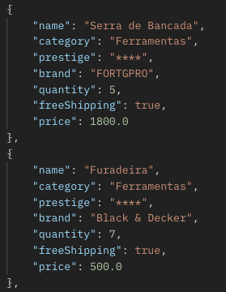
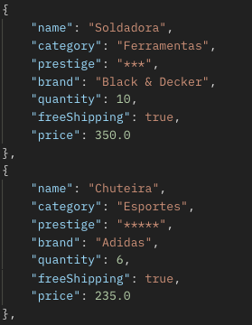
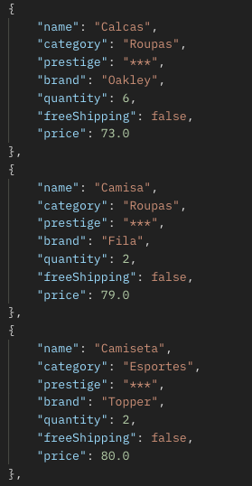
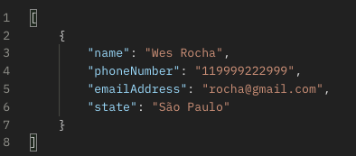
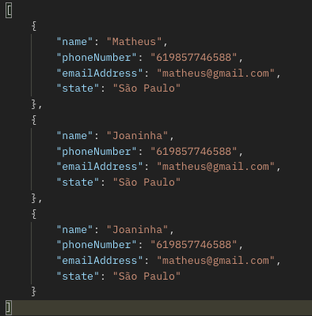
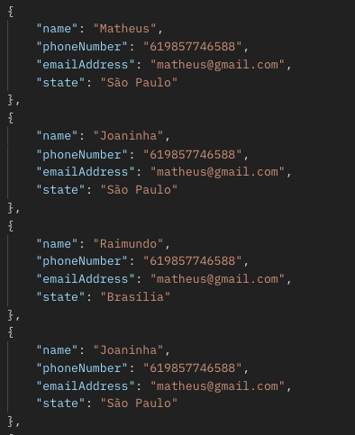
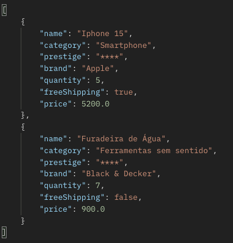
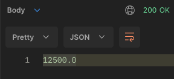

# **Endpoint's** 

- **Listar todos os produtos.**<br>
`curl --location --request GET 'http://localhost:8080/api/v1/articles'`

Retorno:<br>

<br><br>

- **Filtrar produto por cateogria.** <br>
Ex: Esportes, Ferramentas, Celulares. <br>
`curl --location --request GET 'http://localhost:8080/api/v1/articles?category=Esportes'`

Retorno:<br>

<br><br>

- **Filtrar por Frete Grátis.** <br>
Ex: True ou False. <br>
`curl --location --request GET 'http://localhost:8080/api/v1/articles?freeShipping=true'`
<br><br>

- **Filtrar por Frete Grátis e Categoria.** <br>
`curl --location --request GET 'http://localhost:8080/api/v1/articles?freeShipping=true&category=Ferramentas'`
<br><br>

- **Ordenação:**<br>
`curl --location --request GET 'http://localhost:8080/api/v1/articles?order=0' \
  --data-raw ''`

0 = Por nome em ordem crescente <br>
1 = Por nome em ordem decrescente <br>
2 = Por valor em ordem crescente <br>
3 = Por valor em ordem decrescente <br>

Retorno:<br>

<br><br>

- **Cadastrar novos clientes.** <br>
`curl --location --request POST 'http://localhost:8080/api/v1/clients' \
  --header 'Content-Type: application/json' \
  --data-raw '[
  {
  "clientId": "29",
  "name": "Wes Rocha",
  "phoneNumber": "119999222999",
  "emailAddress": "rocha@gmail.com",
  "state": "São Paulo"
  }
  ]'`

Valor esperado:<br>
```
[
    {
        "clientId": "29",
        "name": "Rocha",
        "phoneNumber": "119999222999",
        "emailAddress": "rocha@gmail.com",
        "state": "São Paulo"
    }
]
```

Retorno:<br>

<br><br>

- **Listar os clientes filtrando por estado.**<br>
`curl --location --request GET 'http://localhost:8080/api/v1/clients?state=São Paulo' \
  --data-raw ''`

Retorno:<br>

<br><br>

- **Listar todos os clientes.**<br>
`curl --location --request GET 'http://localhost:8080/api/v1/clients' \
  --data-raw ''`

Retorno:<br>

<br><br>

- **Cadastrar Lista de Produtos.**<br>
`curl --location --request POST 'http://localhost:8080/api/v1/articles' \
  --header 'Content-Type: application/json' \
  --data-raw '[
  {
  "productId":1,
  "name":"Iphone 15",
  "category":"Smartphone",
  "brand":"Apple",
  "price":5200.00,
  "quantity":5,
  "freeShipping":true,
  "prestige":"****"
  },     
  {
  "productId":2,
  "name":"Furadeira de Água",
  "category":"Ferramentas sem sentido",
  "brand":"Black & Decker",
  "price":900.00,
  "quantity":7,
  "freeShipping":false,
  "prestige":"****"
  }
  ]
  '`

Valor esperado:<br>
```
[
      {
         "productId":1,
         "name":"Iphone 15",
         "category":"Smartphone",
         "brand":"Apple",
         "price":5200.00,
         "quantity":5,
         "freeShipping":true,
         "prestige":"****"
      },     
      {
         "productId":2,
         "name":"Furadeira de Água",
         "category":"Ferramentas sem sentido",
         "brand":"Black & Decker",
         "price":900.00,
         "quantity":7,
         "freeShipping":false,
         "prestige":"****"
      }
]
```
Retorno:<br>

<br><br>

- **Calcular Valor Total.**<br>
`curl --location --request POST 'http://localhost:8080/api/v1/articles/totalValue' \
  --header 'Content-Type: application/json' \
  --data-raw '[
  {
  "productId": 1,
  "quantity": 1
  },
  {
  "productId": 2,
  "quantity": 1
  }
  ]
  '`

Valor esperado:<br>
```
[
 {
   "productId": 1,
   "quantity": 1
  },
  {
   "productId": 2,
   "quantity": 1
   }
]
```

Retorno:<br>


<br><br><br><br>

- [Desafio Spring - Main](https://github.com/Vila-java/Desafio_Spring)
